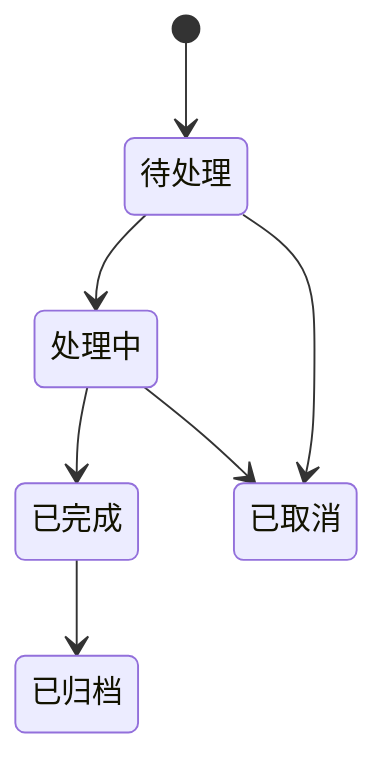
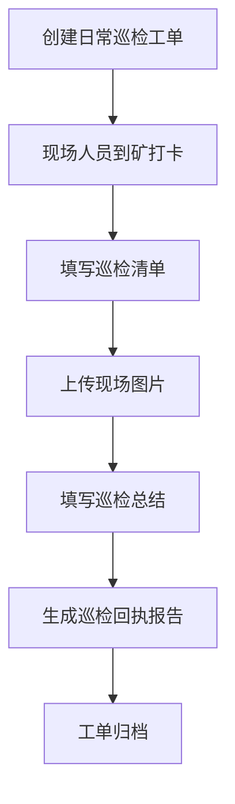

# 运维内部工单系统功能需求分析

## 1. 项目定位

本系统是一个面向公司内部运维团队的轻量级工单与现场维保记录系统，主要服务于煤矿现场相关的软件系统运维、硬件故障处理、日常巡检和维保报告沉淀。

当前团队规模约 15 人左右，包含线上系统运维工程师和现场实施人员。系统不面向外部客户开放，也不需要高并发能力，重点是解决当前没有工单系统、没有统一记录、无法自动生成报告、现场维保过程缺少证据留痕的问题。

系统核心目标：

1. 线上运维接收煤矿反馈问题后，可以形成工单记录。
2. 需要现场处理时，现场人员到煤矿后完成打卡。
3. 现场人员处理工单时上传维修前、维修后、现场环境等图片。
4. 系统记录本次维保内容、处理结果、注意事项和总结。
5. 日常巡检作为工单的一种，支持巡检记录和巡检回执报告生成。
6. 所有煤矿、工单、巡检、图片、报告形成可查询、可追溯的内部档案。

## 2. 使用角色

当前不设计复杂角色体系，只保留必要角色。

| 角色 | 说明 | 主要操作 |
| --- | --- | --- |
| 线上运维工程师 | 接收煤矿反馈，远程排查系统问题；如果需要现场处理，则创建现场工单 | 创建工单、填写问题描述、查看处理结果 |
| 现场实施人员 | 到煤矿现场处理硬件或现场环境问题，也可能执行巡检工单 | 到矿打卡、处理工单、上传图片、填写维保总结、提交巡检 |
| 管理员 | 维护用户、煤矿信息、工单基础配置 | 管理账号、煤矿、工单类型、巡检清单 |

说明：

1. 前期可以不区分复杂权限，只要区分普通用户和管理员即可。
2. 线上运维和现场实施人员可以是同一套用户，只是承担不同工作场景。
3. 后续如果人员增加，再扩展项目负责人、审核人、只读查看人等角色。

## 3. 业务范围

### 3.1 当前必须解决的问题

1. 没有统一工单系统，问题来源和处理过程分散在微信、电话或人工记录中。
2. 现场处理缺少到矿时间、现场图片和处理结果留痕。
3. 维修前后图片没有结构化保存，不方便对比和追溯。
4. 巡检没有系统化记录，也无法快速生成巡检回执报告。
5. 后续查询某个煤矿历史问题、维保内容、巡检情况不方便。

### 3.2 本期核心功能

1. 用户登录。
2. 煤矿档案管理。
3. 工单管理。
4. 到矿打卡。
5. 现场图片上传。
6. 维保内容填写。
7. 日常巡检工单。
8. 巡检回执报告生成。
9. 工单记录查询。

### 3.3 暂不考虑的功能

1. 复杂审批流程。
2. 高并发架构。
3. 客户外部门户。
4. 备件库存管理。
5. 工程师实时轨迹。
6. 复杂 SLA 考核。
7. 大屏展示。
8. 自动排班。
9. 多级组织权限。

## 4. 工单类型

系统中的工单暂分为两类。

| 工单类型 | 说明 | 典型场景 |
| --- | --- | --- |
| 现场工单 | 线上运维判断需要现场处理后创建，现场人员到煤矿处理 | 硬件故障、线路问题、设备更换、现场环境排查 |
| 日常巡检工单 | 对煤矿基础设施进行巡检并生成回执报告 | 服务器、网络、摄像头、传感器、现场设备、系统运行状态检查 |

后续可以增加：

1. 远程支持工单。
2. 安装调试工单。
3. 系统升级工单。
4. 培训服务工单。

但前期不需要过度拆分，避免增加录入负担。

## 4.1 字段口径说明

本文中出现的字段均为“需求分析阶段的初版字段草案”，不是最终数据库字段。

当前阶段只建议先确认：

1. 系统需要哪些业务对象。
2. 每个业务对象大概需要记录哪些信息。
3. 哪些信息是第一版必须填写。
4. 哪些信息可以后续随着实际使用再调整。

不建议现在把所有字段一次性定死，原因：

1. 工单实际填写习惯需要通过原型和试用确认。
2. 每个煤矿的巡检内容不同，清单字段一定会调整。
3. 报告模板确定后，报告字段可能会变化。
4. App 现场填写时，字段过多会影响使用体验。

字段设计原则：

| 类型 | 处理方式 |
| --- | --- |
| 核心字段 | 第一版先固定，例如工单标题、煤矿、工单类型、状态、处理人、创建时间 |
| 可变字段 | 先做成备注、描述、字典或配置项，例如问题类型、图片分类、巡检项 |
| 报告字段 | 等报告模板确认后再细化 |
| 巡检字段 | 按煤矿配置清单，不在数据库里写死具体检查项 |

## 5. 工单状态

前期建议使用简单状态流转。

状态说明：

| 状态 | 说明 |
| --- | --- |
| 待处理 | 工单已创建，但现场人员还未开始处理 |
| 处理中 | 现场人员已到矿打卡，或已经开始填写处理内容 |
| 已完成 | 现场处理或巡检已提交完成 |
| 已归档 | 报告已生成，工单作为历史记录保存 |
| 已取消 | 工单无需处理或创建错误 |

是否需要“审核”可以后续再加。当前阶段建议工单提交完成后即可生成记录和报告，减少流程阻力。

## 6. 现场工单功能需求

### 6.1 创建现场工单

创建入口主要由线上运维工程师使用。

初版信息项建议：

| 字段 | 必填 | 说明 |
| --- | --- | --- |
| 工单标题 | 是 | 简要描述问题 |
| 所属煤矿 | 是 | 选择煤矿 |
| 问题描述 | 是 | 煤矿反馈内容、线上排查结论 |
| 问题类型 | 否 | 硬件、网络、设备、系统环境等 |
| 优先级 | 否 | 普通、紧急 |
| 指派人员 | 否 | 可指定现场实施人员，也可后续领取 |
| 附件 | 否 | 线上截图、日志、煤矿反馈图片 |
| 备注 | 否 | 其他说明 |

创建后，工单进入“待处理”状态。

### 6.2 到矿打卡

现场人员到达煤矿后进行打卡。

打卡记录包括：

1. 煤矿名称。
2. 打卡时间。
3. 当前经纬度。
4. 当前定位地址。
5. 定位精度。
6. 打卡照片。
7. 备注说明。

定位建议：

1. App 获取现场人员当前位置。
2. 使用腾讯地图 API 将经纬度转换为可读地址。
3. 保存经纬度、定位地址、定位精度和打卡时间。
4. 如果定位失败，允许现场人员填写说明后继续提交。
5. 前期不做严格电子围栏，只做现场留痕。

前期建议定位只做辅助留痕，不做严格考勤。原因是煤矿现场可能存在定位漂移、网络差、室内定位不准等情况。

### 6.3 工单定位导航

现场人员打开工单详情后，应能快速查看煤矿位置并发起导航。

功能要求：

1. 煤矿档案中保存煤矿经纬度。
2. 工单详情展示煤矿名称、地址和导航入口。
3. 点击导航后，App 调用腾讯地图能力打开路线导航。
4. 如果手机已安装腾讯地图，可优先调起腾讯地图 App。
5. 如果未安装腾讯地图，可使用腾讯地图 Web 导航或系统地图能力。
6. 导航目标为工单关联煤矿的经纬度。
7. 打卡时仍以现场人员当前位置作为打卡记录，不直接使用煤矿坐标代替。

### 6.4 填写维保内容

现场人员处理完成后填写维保记录。

初版信息项建议：

| 字段 | 必填 | 说明 |
| --- | --- | --- |
| 现场问题确认 | 是 | 到现场后确认的实际问题 |
| 处理过程 | 是 | 进行了哪些排查、维修、更换或调整 |
| 处理结果 | 是 | 已恢复、部分恢复、需后续跟进等 |
| 注意事项 | 否 | 对煤矿或后续维护人员的提示 |
| 遗留问题 | 否 | 未解决事项或需后续处理内容 |
| 现场负责人/联系人 | 否 | 煤矿现场对接人员 |
| 完成时间 | 自动 | 提交完成时记录 |

### 6.5 图片上传

图片是本系统的核心证据材料。

图片分类建议：

| 分类 | 说明 |
| --- | --- |
| 维修前图片 | 设备、线路、环境、故障状态原图 |
| 维修后图片 | 处理完成后的对比图片 |
| 现场环境图片 | 机房、设备柜、安装位置等 |
| 过程图片 | 拆装、检测、更换、接线等过程记录 |
| 其他附件 | 日志、截图、文档等 |

上传要求：

1. 支持一次上传多张图片。
2. 支持图片预览。
3. 支持按分类管理图片。
4. 支持填写图片说明。
5. App 端拍照时尽量保留时间信息。
6. 后续可考虑图片水印：煤矿名称、时间、人员。

### 6.6 完成工单

现场人员提交维保内容和图片后，可将工单标记为“已完成”。

完成后系统应：

1. 保存完整工单记录。
2. 保存所有图片和附件。
3. 生成维保记录摘要。
4. 支持后续查看和导出。

## 7. 日常巡检工单功能需求

### 7.1 巡检定位

巡检不单独做一套复杂模块，而是作为工单类型存在。

巡检工单流程：

### 7.2 巡检清单

每个煤矿的巡检清单可能不同，因此系统需要支持后期按煤矿维护巡检项。

前期功能要求：

1. 支持给每个煤矿配置巡检清单。
2. 巡检清单支持后期调整。
3. 巡检项可以填写正常、异常、无需检查。
4. 每个巡检项可以填写描述。
5. 每个巡检项可以上传图片。

暂时不在需求文档中列举具体清单项，后续根据煤矿实际情况再补充。

### 7.3 巡检记录填写

初版信息项建议：

| 字段 | 必填 | 说明 |
| --- | --- | --- |
| 巡检煤矿 | 是 | 自动关联工单煤矿 |
| 巡检人员 | 是 | 当前登录用户 |
| 到矿时间 | 自动 | 来自打卡 |
| 巡检项结果 | 是 | 按清单逐项填写 |
| 现场图片 | 否 | 可按巡检项或整体上传 |
| 异常说明 | 否 | 有异常时填写 |
| 巡检总结 | 是 | 本次巡检整体结论 |
| 注意事项 | 否 | 后续维护建议 |

### 7.4 巡检回执报告

巡检完成后，系统需要生成对应回执报告。

报告内容建议包括：

1. 煤矿名称。
2. 巡检人员。
3. 巡检时间。
4. 到矿打卡信息。
5. 巡检清单明细。
6. 异常项说明。
7. 现场图片。
8. 巡检总结。
9. 注意事项。

报告格式：

1. 前期至少支持在线预览。
2. 建议支持导出 PDF。
3. 后续可支持 Word 或 Excel。

## 8. 煤矿档案管理

煤矿档案是工单和巡检的基础数据。

初版信息项建议：

| 字段 | 必填 | 说明 |
| --- | --- | --- |
| 煤矿名称 | 是 | 工单、打卡、报告中使用 |
| 地址 | 否 | 用于定位和记录 |
| 联系人 | 否 | 煤矿现场联系人 |
| 联系电话 | 否 | 现场沟通 |
| 经度 | 否 | 用于导航和地图定位 |
| 纬度 | 否 | 用于导航和地图定位 |
| 定位地址 | 否 | 腾讯地图解析后的地址 |
| 备注 | 否 | 特殊说明 |
| 巡检清单 | 否 | 当前煤矿适用的巡检项 |

煤矿详情页应能查看：

1. 基本信息。
2. 历史现场工单。
3. 历史巡检工单。
4. 历史维保图片。
5. 历史报告。

## 9. App 端功能需求

由于系统内部使用，移动端建议做 App，不需要上线应用商店，可以通过内部安装包分发。

App 主要功能：

1. 登录。
2. 工单列表。
3. 工单详情。
4. 到矿打卡。
5. 煤矿定位导航。
6. 拍照上传。
7. 维保内容填写。
8. 巡检清单填写。
9. 巡检报告查看。
10. 历史记录查询。

App 设计重点：

1. 现场填写步骤要少。
2. 图片上传要方便。
3. 弱网情况下表单内容尽量不要丢失。
4. 常用内容支持保存草稿。
5. 页面按钮要大，适合现场手机操作。

## 10. 管理后台功能需求

管理后台主要给线上运维和管理员使用。

功能包括：

1. 工单列表。
2. 创建工单。
3. 查看工单详情。
4. 查看维保图片。
5. 查看巡检报告。
6. 煤矿管理。
7. 巡检清单配置。
8. 用户管理。

前期后台不需要复杂首页看板，只需要基础统计即可：

1. 工单总数。
2. 已完成工单数。
3. 未完成工单数。
4. 按煤矿查看工单数量。
5. 按人员查看处理数量。

## 11. 查询与归档

系统需要支持按以下条件查询历史记录：

1. 煤矿名称。
2. 工单类型。
3. 工单状态。
4. 处理人员。
5. 创建时间。
6. 完成时间。
7. 关键词。

查询结果应能快速进入详情页，查看：

1. 问题描述。
2. 处理内容。
3. 维修前后图片。
4. 巡检清单。
5. 报告文件。
6. 注意事项。

## 12. 报告生成需求

报告生成是系统核心价值之一。

### 12.1 维保报告

现场工单完成后，可生成维保报告。

报告内容：

1. 工单编号。
2. 煤矿名称。
3. 问题描述。
4. 现场问题确认。
5. 处理过程。
6. 处理结果。
7. 维修前图片。
8. 维修后图片。
9. 注意事项。
10. 处理人员。
11. 到矿时间和完成时间。

### 12.2 巡检回执报告

日常巡检工单完成后，可生成巡检回执报告。

报告内容：

1. 煤矿名称。
2. 巡检人员。
3. 巡检时间。
4. 巡检清单结果。
5. 异常项说明。
6. 现场图片。
7. 巡检总结。
8. 注意事项。

## 13. 非功能需求

| 类别 | 要求 |
| --- | --- |
| 使用范围 | 内部使用，约 15 人规模 |
| 并发要求 | 不需要高并发，保证日常稳定即可 |
| 移动端 | 优先 App，内部安装包分发 |
| 数据安全 | 登录后访问，普通用户只能看相关工单 |
| 图片存储 | 支持多图上传、预览、分类和长期保存 |
| 弱网处理 | App 表单和图片上传需要失败重试或草稿保存 |
| 报告 | 支持在线预览，建议支持 PDF 导出 |
| 可维护性 | 功能简单清晰，方便单人长期维护 |

## 14. 第一版建议范围

第一版只做最核心闭环：

1. 登录和用户管理。
2. 煤矿管理。
3. 现场工单。
4. 日常巡检工单。
5. 到矿打卡。
6. 图片上传和分类。
7. 维保内容填写。
8. 巡检清单填写。
9. 维保报告和巡检回执报告。
10. 工单历史查询。

第一版不做：

1. 复杂审批。
2. 客户端入口。
3. 大屏。
4. 备件。
5. 自动排班。
6. 实时定位轨迹。
7. 复杂统计报表。

## 15. 后续可扩展方向

后续在第一版稳定后，可以逐步增加：

1. 图片水印。
2. 电子签名。
3. 工单审核。
4. 工单导出 Excel。
5. 煤矿维保档案汇总。
6. 常见问题知识库。
7. App 离线缓存。
8. 远程支持工单。
9. 系统告警自动生成工单。
