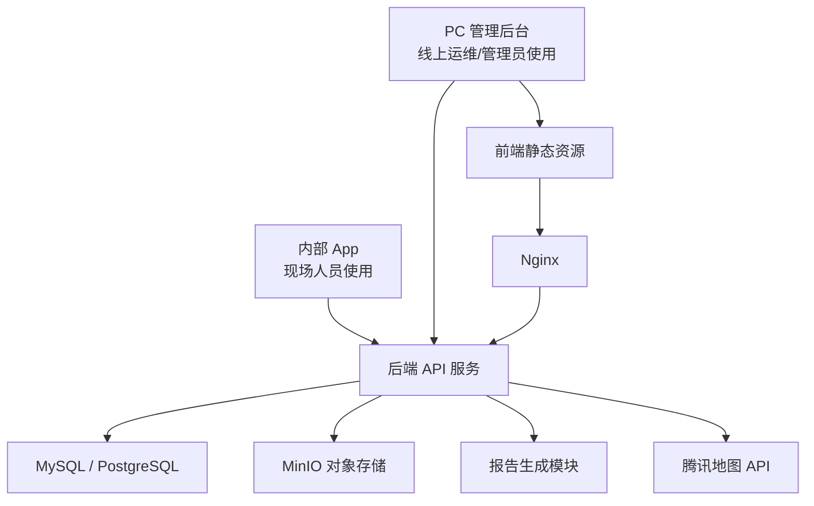
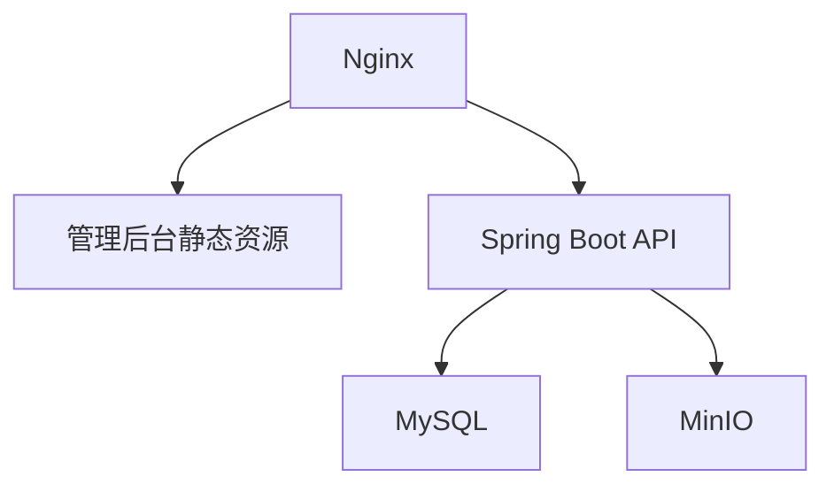

# 运维内部工单系统技术架构设计

## 1. 架构定位

本项目是小团队内部使用的运维工单与现场维保记录系统，团队规模约 15 人，不需要高并发和复杂微服务架构。

技术架构目标：

1. 单人可以独立开发和长期维护。
2. 部署简单，优先一台服务器即可运行。
3. 功能聚焦工单、打卡、图片上传、巡检、报告生成。
4. 数据结构清晰，后续可扩展但前期不复杂化。
5. App、管理后台、后端服务之间边界明确。

## 2. 总体架构

推荐采用单体应用架构。



核心组成：

| 模块 | 说明 |
| --- | --- |
| 内部 App | 现场人员到矿打卡、处理工单、上传图片、填写巡检 |
| PC 管理后台 | 线上运维创建工单、查看记录、维护煤矿和巡检清单 |
| 后端 API 服务 | 提供用户、工单、打卡、图片、报告等接口 |
| 数据库 | 保存用户、煤矿、工单、巡检、报告、附件元数据 |
| MinIO 对象存储 | 保存图片、报告文件、附件 |
| 腾讯地图 API | 用于当前位置逆地址解析、煤矿坐标维护和工单导航 |
| Nginx | 静态资源托管、接口反向代理 |

## 3. 推荐技术选型

### 3.1 首选方案

考虑本项目需要内部 App，又需要 PC 管理后台，并且由一个人长期维护，推荐：

| 层级 | 推荐技术 | 原因 |
| --- | --- | --- |
| 内部 App | uni-app + Vue 3 | 可打包 Android App，也可复用 Vue 技术栈 |
| PC 管理后台 | Vue 3 + Vite + Element Plus | 后台表格、表单、上传组件成熟 |
| 后端 | Spring Boot 3 + MyBatis Plus | 企业内部系统常见，CRUD 和权限实现稳定 |
| 数据库 | MySQL 8 | 运维成本低，资料多，部署方便 |
| 文件存储 | MinIO 单节点单磁盘 | 文件路径统一，后续迁移和备份更方便 |
| 报告生成 | 后端 HTML 模板生成 PDF | 适合维保报告和巡检回执报告 |
| 地图服务 | 腾讯地图 API | 适合国内定位、地址解析和导航场景 |
| 部署 | Docker Compose | 单机即可运行，便于同时管理 MySQL、后端、Nginx、MinIO |

### 3.2 可替代方案

如果更偏前端全栈，也可以使用：

| 层级 | 可选技术 |
| --- | --- |
| App | uni-app / Flutter |
| 管理后台 | Vue 3 / React |
| 后端 | NestJS / FastAPI |
| 数据库 | PostgreSQL / MySQL |

但如果没有特别偏好，建议不要在第一版引入太多不同技术栈。`uni-app + Vue 3 + Spring Boot + MySQL` 对单人开发比较稳。

## 4. 为什么不建议微服务

本项目当前不适合微服务，原因：

1. 用户规模小。
2. 业务模块不复杂。
3. 单人维护，微服务会增加部署、日志、排错、接口联调成本。
4. 当前核心问题是业务闭环和记录留痕，不是服务拆分。

建议先做模块化单体：

```text
backend
├── user        用户与登录
├── mine        煤矿档案
├── ticket      工单
├── attendance  打卡
├── map         腾讯地图定位与导航
├── inspection  巡检
├── attachment  图片与附件
├── report      报告生成
└── system      字典、配置、日志
```

后续如果系统扩大，可以再按模块拆分。

## 5. 后端模块设计

### 5.1 用户与登录模块

功能：

1. 用户登录。
2. Token 鉴权。
3. 用户管理。
4. 简单角色控制。

角色建议：

| 角色 | 权限 |
| --- | --- |
| 管理员 | 所有数据和配置 |
| 普通用户 | 查看和处理自己的工单，可查看必要煤矿信息 |

前期不做复杂菜单权限和数据权限矩阵。

### 5.2 煤矿档案模块

功能：

1. 煤矿新增、编辑、停用。
2. 煤矿联系人维护。
3. 煤矿地址、经纬度和定位地址维护。
4. 查看煤矿历史工单和巡检记录。
5. 维护该煤矿的巡检清单。
6. 支持通过腾讯地图选择或校准煤矿坐标。

### 5.3 工单模块

功能：

1. 创建现场工单。
2. 创建日常巡检工单。
3. 工单列表和详情。
4. 工单状态流转。
5. 指派处理人员。
6. 填写现场处理内容。
7. 关联打卡、图片、报告。

工单状态：

```text
待处理 -> 处理中 -> 已完成 -> 已归档
待处理/处理中 -> 已取消
```

### 5.4 打卡模块

功能：

1. 到矿打卡。
2. 保存打卡时间。
3. 保存定位信息。
4. 保存打卡照片。
5. 与工单关联。
6. 使用腾讯地图 API 解析当前位置地址。

设计原则：

1. 打卡用于现场留痕，不做严格考勤。
2. 定位失败时允许填写说明。
3. 同一个工单至少记录一次到矿打卡。
4. 打卡保存现场人员当前位置，不用煤矿坐标替代当前位置。

### 5.5 地图与导航模块

功能：

1. 保存煤矿经纬度。
2. App 打卡时获取现场人员当前位置。
3. 调用腾讯地图逆地址解析，将经纬度转换为地址。
4. 工单详情提供导航入口。
5. 根据煤矿坐标调起腾讯地图导航。

接入方式建议：

1. App 端负责获取当前位置经纬度。
2. 后端负责调用腾讯地图 WebService API 做逆地址解析，避免地图 Key 暴露过多。
3. 煤矿坐标维护可在管理后台通过地图选点完成。
4. 导航可优先使用腾讯地图 URI 或 App 能力调起。
5. 若用户手机未安装腾讯地图，可退化为 Web 地图导航。

### 5.6 图片与附件模块

功能：

1. 上传维修前图片。
2. 上传维修后图片。
3. 上传现场环境图片。
4. 上传巡检图片。
5. 图片分类管理。
6. 图片预览和删除。

存储方式：

第一版直接使用 MinIO，不再使用普通本地文件目录作为业务存储。

建议创建一个业务桶：

```text
met-mto
```

对象路径按日期、业务和分类组织：

```text
ticket/2026/06/03/{ticketId}/before/xxx.jpg
ticket/2026/06/03/{ticketId}/after/xxx.jpg
ticket/2026/06/03/{ticketId}/scene/xxx.jpg
inspection/2026/06/03/{ticketId}/xxx.jpg
report/2026/06/03/{ticketId}/maintenance.pdf
```

数据库只保存 bucket、object key、原始文件名、文件类型、大小、上传人、关联工单。

### 5.7 巡检模块

功能：

1. 每个煤矿维护巡检清单。
2. 创建日常巡检工单。
3. App 端按清单填写巡检结果。
4. 巡检项支持正常、异常、无需检查。
5. 巡检项支持说明和图片。
6. 提交后生成巡检回执报告。

前期不需要固定周期计划，也不需要复杂模板版本管理。

### 5.8 报告生成模块

报告类型：

1. 维保报告。
2. 巡检回执报告。

生成方式建议：

1. 后端根据工单数据渲染 HTML 模板。
2. HTML 可在线预览。
3. 使用 PDF 工具生成 PDF 文件。
4. PDF 路径保存到报告表。

技术选择：

| 方式 | 说明 |
| --- | --- |
| HTML 模板 + PDF | 推荐，开发和调整模板较方便 |
| Word 模板填充 | 适合公司已有固定 Word 模板 |
| Excel 导出 | 后续可扩展 |

如果公司已有固定报告格式，建议优先用 Word 模板或 HTML 模板复刻。

## 6. 数据库设计

本节是第一版参考数据结构，用于指导后续原型和开发，不代表最终数据库字段已经锁定。

当前阶段只需要先稳定核心对象关系：

```text
用户 -> 工单 -> 煤矿
工单 -> 打卡
工单 -> 图片附件
工单 -> 巡检结果
工单 -> 报告
煤矿 -> 巡检清单
```

字段设计原则：

1. 先固定核心字段，例如主键、工单编号、煤矿、工单类型、状态、创建人、处理人、创建时间。
2. 容易变化的内容先使用字典、配置表或备注字段，例如问题类型、图片分类、巡检项。
3. 巡检清单不写死在代码中，按煤矿维护。
4. 报告字段等报告模板确认后再细化。
5. 第一版不要为了“看起来完整”增加太多字段，避免 App 填写变重。

### 6.1 初版核心表

| 表名 | 说明 |
| --- | --- |
| sys_user | 用户 |
| sys_role | 角色 |
| mine_site | 煤矿档案 |
| mine_contact | 煤矿联系人 |
| ticket | 工单主表 |
| ticket_record | 工单处理记录 |
| attendance | 到矿打卡记录 |
| attachment | 图片和附件 |
| inspection_item | 煤矿巡检清单项 |
| inspection_result | 巡检结果 |
| report | 报告记录 |
| sys_dict | 字典配置 |

### 6.2 煤矿表 mine_site 初版定位字段

| 字段 | 说明 |
| --- | --- |
| longitude | 煤矿经度 |
| latitude | 煤矿纬度 |
| location_address | 腾讯地图解析或手动维护的定位地址 |
| location_remark | 坐标备注，例如矿门口、办公楼、调度室 |

### 6.3 工单表 ticket 初版字段

| 字段 | 说明 |
| --- | --- |
| id | 主键 |
| ticket_no | 工单编号 |
| type | 工单类型：现场工单、日常巡检工单 |
| title | 标题 |
| mine_id | 煤矿 ID |
| status | 状态 |
| priority | 优先级 |
| problem_desc | 问题描述 |
| assignee_id | 处理人 |
| creator_id | 创建人 |
| started_at | 开始处理时间 |
| completed_at | 完成时间 |
| created_at | 创建时间 |
| updated_at | 更新时间 |

### 6.4 工单处理记录 ticket_record 初版字段

| 字段 | 说明 |
| --- | --- |
| id | 主键 |
| ticket_id | 工单 ID |
| site_problem | 现场确认问题 |
| process_desc | 处理过程 |
| result_desc | 处理结果 |
| notice | 注意事项 |
| remaining_problem | 遗留问题 |
| created_by | 填写人 |
| created_at | 创建时间 |

### 6.5 打卡表 attendance 初版字段

| 字段 | 说明 |
| --- | --- |
| id | 主键 |
| ticket_id | 工单 ID |
| mine_id | 煤矿 ID |
| user_id | 打卡人 |
| checkin_time | 打卡时间 |
| longitude | 经度 |
| latitude | 纬度 |
| address | 定位地址 |
| accuracy | 定位精度 |
| map_provider | 地图服务商，例如 tencent |
| photo_attachment_id | 打卡照片 |
| remark | 备注 |

### 6.6 附件表 attachment 初版字段

| 字段 | 说明 |
| --- | --- |
| id | 主键 |
| biz_type | 业务类型：工单、巡检、打卡、报告 |
| biz_id | 业务 ID |
| category | 图片分类：维修前、维修后、现场、巡检等 |
| file_name | 原始文件名 |
| file_path | 存储路径 |
| file_type | 文件类型 |
| file_size | 文件大小 |
| description | 图片说明 |
| uploaded_by | 上传人 |
| created_at | 上传时间 |

### 6.7 巡检清单表 inspection_item 初版字段

| 字段 | 说明 |
| --- | --- |
| id | 主键 |
| mine_id | 煤矿 ID |
| item_name | 巡检项名称 |
| item_desc | 巡检项说明 |
| sort_order | 排序 |
| enabled | 是否启用 |

### 6.8 巡检结果表 inspection_result 初版字段

| 字段 | 说明 |
| --- | --- |
| id | 主键 |
| ticket_id | 工单 ID |
| item_id | 巡检项 ID |
| result_status | 正常、异常、无需检查 |
| description | 巡检描述 |
| created_by | 填写人 |
| created_at | 创建时间 |

### 6.9 报告表 report 初版字段

| 字段 | 说明 |
| --- | --- |
| id | 主键 |
| ticket_id | 工单 ID |
| report_type | 维保报告、巡检回执报告 |
| report_title | 报告标题 |
| html_content | 报告 HTML 内容，可选 |
| pdf_path | PDF 文件路径 |
| created_by | 生成人 |
| created_at | 生成时间 |

## 7. 接口设计

### 7.1 App 端接口

| 接口 | 方法 | 说明 |
| --- | --- | --- |
| /api/app/login | POST | 登录 |
| /api/app/tickets | GET | 我的工单列表 |
| /api/app/tickets/{id} | GET | 工单详情 |
| /api/app/tickets/{id}/checkin | POST | 到矿打卡 |
| /api/app/tickets/{id}/records | POST | 提交维保记录 |
| /api/app/tickets/{id}/complete | POST | 完成工单 |
| /api/app/tickets/{id}/inspection-results | POST | 提交巡检结果 |
| /api/app/attachments | POST | 上传图片 |
| /api/app/reports/{id} | GET | 查看报告 |
| /api/app/map/reverse-geocode | POST | 当前位置逆地址解析 |
| /api/app/tickets/{id}/navigation | GET | 获取工单煤矿导航信息 |

### 7.2 管理后台接口

| 接口 | 方法 | 说明 |
| --- | --- | --- |
| /api/admin/login | POST | 登录 |
| /api/admin/tickets | GET/POST | 工单列表/创建 |
| /api/admin/tickets/{id} | GET/PUT | 工单详情/编辑 |
| /api/admin/tickets/{id}/assign | POST | 指派人员 |
| /api/admin/mines | GET/POST | 煤矿列表/新增 |
| /api/admin/mines/{id} | GET/PUT | 煤矿详情/编辑 |
| /api/admin/mines/{id}/location | PUT | 更新煤矿坐标 |
| /api/admin/mines/{id}/inspection-items | GET/POST | 巡检清单 |
| /api/admin/users | GET/POST | 用户管理 |
| /api/admin/reports/{ticketId}/generate | POST | 生成报告 |

## 8. App 架构建议

App 页面：

```text
pages
├── login
├── ticket-list
├── ticket-detail
├── checkin
├── map-navigation
├── ticket-record
├── inspection-form
├── image-upload
└── report-preview
```

App 关键能力：

1. 拍照上传。
2. 图片压缩。
3. 表单草稿。
4. 定位获取。
5. 腾讯地图导航。
6. PDF/HTML 报告预览。

内部 App 分发：

1. Android APK 内部分发即可。
2. 不需要上架应用商店。
3. iOS 如果没有企业证书，前期不建议投入。
4. 如果现场人员主要用 Android，优先做好 Android。

## 9. 管理后台架构建议

管理后台页面：

```text
views
├── login
├── dashboard
├── ticket
│   ├── list
│   └── detail
├── mine
│   ├── list
│   └── detail
├── inspection-item
├── user
└── report
```

后台重点：

1. 工单列表要好查。
2. 图片预览要方便。
3. 报告生成要简单。
4. 煤矿巡检清单维护要直接。

## 10. 部署方案

### 10.1 单机部署

第一版推荐单机部署。



服务器目录示例：

```text
/opt/met-mto
├── backend
│   └── met-mto-api.jar
├── admin
│   └── dist
├── minio-data
├── logs
└── docker-compose.yml
```

### 10.2 Docker Compose 部署

如果希望部署更规整，可以使用 Docker Compose：

```text
services:
  mysql
  minio
  backend
  nginx
```

第一版不强制使用 Redis 和消息队列。

### 10.3 2G 轻量服务器建议

2G 内存服务器可以做内部试运行，但不建议作为长期稳定生产配置。

原因是本系统如果同机部署 Nginx、后端服务、MySQL 和 MinIO，内存会比较紧。MinIO 官方对正式或扩展场景的内存建议明显高于 2G，因此如果预算允许，建议服务器至少升级到 4G 内存；如果只能使用 2G，则必须控制资源并接受偶发内存压力风险。

建议部署组件：

| 组件 | 建议 |
| --- | --- |
| Nginx | 正常部署，资源占用很低 |
| 后端服务 | 限制 JVM 内存，例如 512MB 到 768MB |
| MySQL | 使用轻量配置，降低 buffer pool，例如 256MB 到 384MB |
| MinIO | 单节点单磁盘运行，只用于内部低并发图片和报告存储 |
| Redis | 第一版不部署 |

注意事项：

1. 强烈建议开启 2GB swap，避免偶发内存不足。
2. 后端 JVM 必须限制最大堆内存。
3. MySQL 必须使用轻量参数，不按默认生产配置运行。
4. 图片上传前在 App 端压缩，避免原图过大。
5. PDF 报告生成不要并发批量执行。
6. MinIO、MySQL、报告文件都要做定时备份。
7. 如果后续图片量很大，优先升级服务器磁盘和内存。

结论：

| 服务器规格 | 建议 |
| --- | --- |
| 2G 内存 | 可以试运行，必须调参和开启 swap |
| 4G 内存 | 更适合本项目第一版正式内部使用 |
| 8G 内存 | 更稳，适合图片和报告逐渐增多后的长期使用 |

## 11. 文件存储策略

前期建议：

1. 图片、报告统一存 MinIO。
2. 数据库存 bucket 和 object key。
3. 对象路径按日期和业务分类。
4. 定期备份 MinIO 数据目录。

示例：

```text
ticket/2026/06/03/{ticketId}/before/xxx.jpg
ticket/2026/06/03/{ticketId}/after/xxx.jpg
report/2026/06/03/{ticketId}/xxx.pdf
```

后续扩展：

1. 图片加水印。
2. 图片压缩和缩略图。
3. 文件访问增加签名链接。
4. MinIO 数据迁移到更大磁盘或独立服务器。

## 12. 安全设计

第一版安全要求：

1. 登录后才能访问系统。
2. Token 过期自动重新登录。
3. 普通用户只能处理自己的工单。
4. 管理员可以查看全部工单。
5. 图片访问需要接口鉴权。
6. 密码加密存储。
7. 重要操作记录日志。

暂不做：

1. 多租户。
2. 复杂数据权限。
3. 单点登录。
4. 细粒度按钮权限。

## 13. 备份与维护

单人维护场景下，备份比复杂架构更重要。

必须备份：

1. 数据库。
2. MinIO 数据目录。
3. 报告文件。

建议：

1. 每天凌晨自动备份数据库。
2. 每天同步 MinIO 数据目录。
3. 备份保留至少 30 天。
4. 每周手动检查一次备份是否可用。

## 14. 后续扩展预留

第一版架构保持简单，但预留以下扩展空间：

| 扩展方向 | 预留方式 |
| --- | --- |
| 图片水印 | 上传接口统一处理图片 |
| MinIO 扩容 | 文件服务封装统一接口，业务不直接依赖本地路径 |
| 工单审核 | 工单状态保留扩展字段 |
| 电子签名 | 报告模块预留签名图片 |
| 远程工单 | 工单类型可扩展 |
| 复杂巡检模板 | 巡检项表可增加分组、类型、必填规则 |
| App 离线缓存 | App 表单增加草稿和同步状态 |

## 15. 第一版技术边界

第一版建议坚持以下边界：

1. 一个后端服务。
2. 一个数据库。
3. 一个 MinIO 对象存储。
4. 一个管理后台。
5. 一个内部 App。
6. 不上微服务。
7. 不上消息队列。
8. 不上复杂工作流。
9. 不做高并发优化。

这样系统更容易快速做出来，也更适合一个人持续维护。
