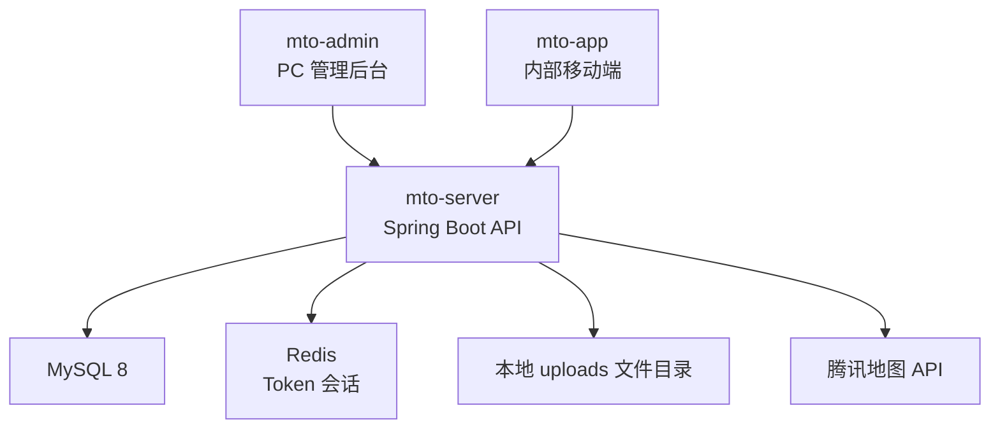

# 运维内部工单系统技术架构设计

## 1. 架构定位

本项目面向小团队内部使用，由单人开发和维护，采用轻量级模块化单体架构。当前不引入微服务、消息队列和复杂部署编排。

核心原则：

1. 后台模型先完成，移动端后续补齐现场能力。
2. 一套 Spring Boot 后端同时服务后台和后续 App。
3. 本地文件存储先跑通，后续上服务器后再按需要切换 MinIO。
4. MySQL 作为主数据库。
5. 腾讯地图用于客户选址、工单导航和打卡定位。

## 2. 总体架构



## 3. 技术选型

| 层级 | 当前选型 | 说明 |
| --- | --- | --- |
| 后台前端 | Vue 3 + Vite + Element Plus | 后台表格、表单和详情页 |
| 后端 | Spring Boot 3 + MyBatis Plus | 适合 CRUD 和内部系统 |
| 数据库 | MySQL 8 | 本地开发账号 root/root |
| 会话 | JWT + Redis | Token 30 分钟过期 |
| 文件存储 | 本地文件目录 | 当前路径 `D:/workspace/met-mto/uploads` |
| 地图 | 腾讯地图 API | 客户选址、定位、导航 |
| 移动端 | 暂定 uni-app + Vue 3 | 后续开发内部 App |

## 4. 项目目录

```text
met-mto
├── mto-admin    管理后台
├── mto-server   后端服务
├── mto-app      内部 App
└── docs         文档
```

后端包结构采用顶层分层，不按业务模块再嵌套 `controller/service/mapper`：

```text
com.met.mto
├── common
├── config
├── controller
├── dto
├── entity
├── exception
├── mapper
├── service
│   └── impl
└── util
```

## 5. 当前后端基础能力

1. 统一返回：`ApiResult`。
2. 分页返回：`PageResult`。
3. 全局异常：`exception` 包，包含异常枚举 `ErrorCode`。
4. 跨域配置。
5. MyBatis Plus 分页插件。
6. MyBatis Plus 控制台 SQL 日志。
7. JWT + Redis 登录鉴权。
8. 本地上传文件静态访问：`/uploads/**`。

## 6. 当前数据库表

| 表名 | 说明 |
| --- | --- |
| `sys_user` | 用户和人员 |
| `customer_site` | 客户现场档案 |
| `customer_device` | 设备档案 |
| `work_order` | 工单主表 |
| `work_order_engineer` | 工单指派工程师 |
| `work_order_record` | 工单流程和处理记录 |
| `file_attachment` | 文件和图片附件 |

当前未建立巡检清单、打卡、报告表，后续 App 和报告功能开发时再补。

## 7. 当前接口约定

后台接口统一使用 `/api/admin` 前缀。

| 模块 | 接口 |
| --- | --- |
| 登录 | `POST /api/admin/auth/login` |
| 当前用户 | `GET /api/admin/auth/me` |
| 客户管理 | `/api/admin/customer-sites` |
| 人员管理 | `/api/admin/users` |
| 设备管理 | `/api/admin/devices` |
| 工单管理 | `/api/admin/work-orders` |
| 工单记录 | `/api/admin/work-orders/{workOrderId}/records` |
| 附件上传和查询 | `/api/admin/attachments` |
| 腾讯地图配置与搜索 | `/api/admin/map/*` |

工单分页已支持：

1. `keyword`
2. `type`
3. `status`
4. `customerSiteId`
5. `engineerId`
6. `page`
7. `size`

客户详情页直接复用 `customerSiteId + type` 查询历史现场工单和巡检工单。

## 8. 附件存储设计

当前采用本地文件存储：

```text
uploads/{yyyy}/{MM}/{dd}/{uuid}.{ext}
```

数据库 `file_attachment` 保存：

1. `biz_type`
2. `biz_id`
3. `category`
4. `original_name`
5. `file_name`
6. `content_type`
7. `file_size`
8. `storage_path`
9. `access_url`
10. `status`

后续切换 MinIO 时，可以在文件服务层增加 bucket、object key，不影响业务层使用方式。

## 9. 2G 轻量服务器建议

2G 服务器可以用于内部试运行，但需要控制资源：

1. 后端 JVM 设置最大堆内存，例如 512MB。
2. MySQL 使用轻量配置。
3. Redis 保持小内存使用。
4. 暂不部署 MinIO。
5. 开启 swap，降低偶发内存不足风险。
6. 图片在 App 端上传前尽量压缩。

如果后续图片和报告数量明显增加，建议升级到 4G 或更高配置。

## 10. 后续技术扩展

1. App 接口分组，例如 `/api/app/*`。
2. 打卡表和定位记录。
3. 巡检清单和巡检结果表。
4. 报告生成模块。
5. 图片水印和压缩。
6. MinIO 或对象存储。
7. 自动备份脚本。
